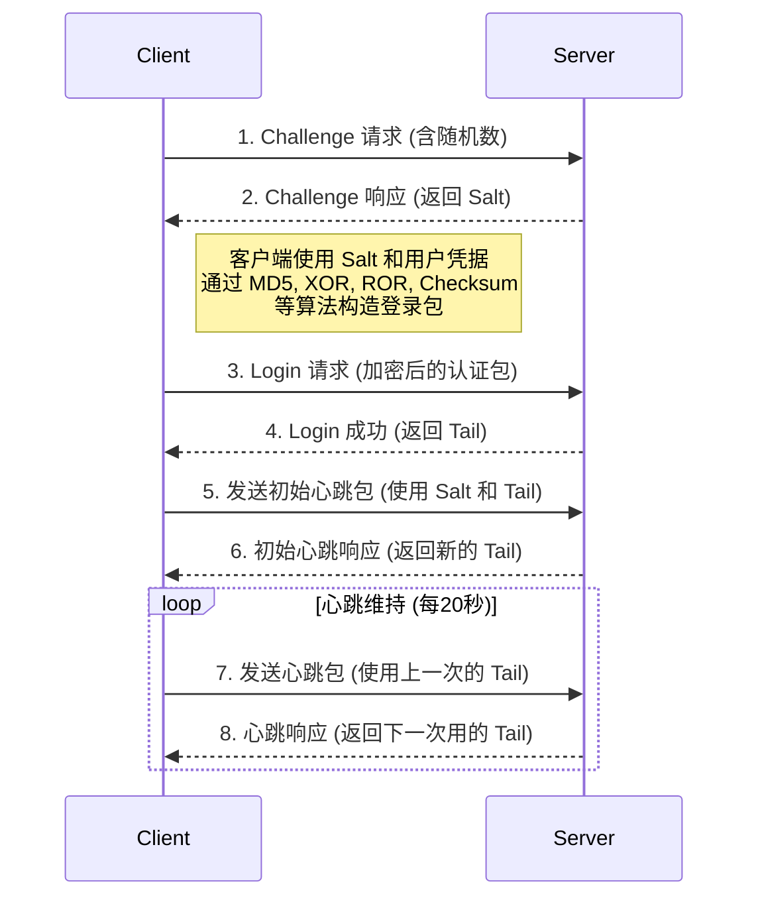

# Dr.COM 校园网客户端认证原理解析

## 目录
1.  [协议概述](#1-协议概述)
2.  [认证流程详解](#2-认证流程详解)
    *   [阶段一：获取 Challenge (盐值)](#阶段一获取-challenge-盐值)
    *   [阶段二：发送登录认证包](#阶段二发送登录认证包)
    *   [阶段三：维持心跳在线](#阶段三维持心跳在线)
3.  [流程图](#3-流程图)
4.  [完整 Python 实现代码](#4-完整-python-实现代码)

## 1. 协议概述

Dr.COM 认证协议是一种在许多校园网中使用的网络准入控制协议。本文档分析的这个版本是基于 UDP 的无连接协议。其核心思想是一种 **“挑战-响应” (Challenge-Response)** 机制，并结合了心跳包来维持在线状态。

整个认证过程可以分为三个主要阶段：

1.  **Challenge 请求**: 客户端向服务器请求一个动态的、一次性的“挑战码”（在代码中称为 `salt` 或盐值）。这一步是为了防止“重放攻击”，确保每次登录的加密过程都是独一无二的。
2.  **Login 请求**: 客户端使用从服务器获取的 `salt` 和用户自身的密码、MAC地址等信息，通过一系列复杂的加密、哈希和校验算法，生成一个最终的登录请求包发送给服务器进行验证。
3.  **Keep-Alive 心跳**: 认证成功后，客户端必须按照固定的时间间隔（约20秒）向服务器发送“心跳包”，以告知服务器自己仍在线。如果服务器在一定时间内未收到心跳包，就会中断该用户的网络连接。

## 2. 认证流程详解

### 阶段一：获取 Challenge (盐值)

这是认证的第一步，目的是从服务器获取一个用于加密密码的4字节随机数（盐值）。

*   **客户端操作**:
    1.  客户端构建一个 Challenge 请求包。这个包结构相对简单：
        *   包头固定为 `b'\x01\x02'`。
        *   跟上一个2字节的随机数。
        *   最后填充一些固定的字节。
    2.  客户端将该数据包发送到认证服务器的 `61440` UDP 端口。
    3.  客户端循环此操作，直到收到合法的服务器响应。

*   **服务器响应**:
    1.  服务器收到请求后，会返回一个响应包。
    2.  如果响应包的第一个字节是 `0x02`，则表示这是一个有效的 Challenge 响应。
    3.  响应包的第 `4` 到 `8` 字节，即为本次登录所需的4字节 `salt`。

*   **代码实现**: 这一过程由 `DrcomClient` 类中的 `_get_challenge` 方法实现。

### 阶段二：发送登录认证包

这是整个协议中最复杂的一步。客户端需要将用户的各种信息（用户名、密码、IP、MAC地址等）与上一步获取的 `salt` 结合，生成一个庞大且复杂的登录数据包。

我们根据代码中 `_build_login_packet` 方法的逻辑来分解这个数据包的构建过程：

1.  **计算核心 MD5 哈希**:
    *   **MD5 #1 (主哈希)**: `md5(b'\x03\x01' + salt + password)`。这个哈希值是后续多个加密步骤的基础。
    *   **MD5 #2 (次哈希)**: `md5(b'\x01' + password + salt + b'\x00\x00\x00\x00')`。

2.  **组装数据包（分段式）**:
    *   **包头**: `b'\x03\x01\x00'`，加上一个动态计算的包长度。
    *   **认证信息**: 放入主哈希（MD5 #1）和用 `\x00` 填充到36字节的用户名。
    *   **MAC 地址混淆**: 将主哈希的前6个字节与客户端的 MAC 地址进行 **按位异或(XOR)** 操作。这一步将登录请求与物理网卡地址绑定，增加了破解和伪造的难度。
    *   **IP 与次哈希**: 放入次哈希（MD5 #2）和客户端的本机 IP 地址。
    *   **第一层校验和 (MD5 Checksum)**: 对以上已组装的数据包内容，拼接上一个固定的“魔法数字” `b'\x14\x00\x07\x0b'` 后，计算 MD5，并取其前8个字节作为校验和，附加到包中。
    *   **主机信息**: 放入主机名、伪装的 DNS 和子网掩码等信息。
    *   **密码加密 (ROR 算法)**: `ror` 函数实现了一种自定义的加密算法。它将主哈希与用户密码进行 XOR，然后对每个字节进行循环右移3位的操作。这是对密码的进一步混淆。
    *   **第二层校验和 (自定义 Checksum)**: 对当前已组装的绝大部分数据包内容，拼接上另一组“魔法数字”和客户端 MAC 地址，然后通过一个自定义的校验算法（`checksum` 函数）计算出一个4字节的校验和。该算法大致为：`ret = 1234; for each 4_bytes_chunk: ret ^= chunk; final = (1968 * ret) & 0xFFFFFFFF`。
    *   **包尾**: 最后，将客户端的真实 MAC 地址和一些固定的填充字节附加到数据包的末尾。

3.  **服务器响应**:
    *   客户端将这个精心构造的数据包发送给服务器。
    *   如果服务器验证通过，会返回一个响应包，其第一个字节为 `0x04`，表示登录成功。
    *   这个成功响应包中包含了后续**心跳阶段**必需的一个关键数据 `package_tail`，客户端必须保存它。

### 阶段三：维持心跳在线

登录成功后，为了防止被服务器踢下线，必须进入心跳维持阶段。

1.  **初始心跳**:
    *   客户端首先会发送一个特殊的“初始心跳包”。这个包同样需要 `salt` 和 `password` 计算 MD5，并包含从登录成功响应中获取的 `package_tail`。

2.  **心跳握手**:
    *   在进入稳定心跳循环之前，有一个简单的三次握手过程。客户端发送一个心跳包，服务器返回一个响应；客户端再使用响应中的部分数据（`tail`）构造下一个心跳包，如此往复。

3.  **稳定心跳循环**:
    *   握手完成后，客户端进入一个无限循环。
    *   每隔约20秒，交替发送两种类型（Type 1 和 Type 3）的心跳包。
    *   与握手过程类似，每次发送心跳包都需要使用上一次服务器响应中返回的 `tail` 数据。这种“链式”结构确保了心跳的连续性和有效性。
    *   这个循环会一直持续，直到用户主动断开连接或程序退出。

*   **代码实现**: 这一过程由 `_keep_alive_loop` 和 `_build_keep_alive_packet` 等相关方法实现。

## 3. 流程图

